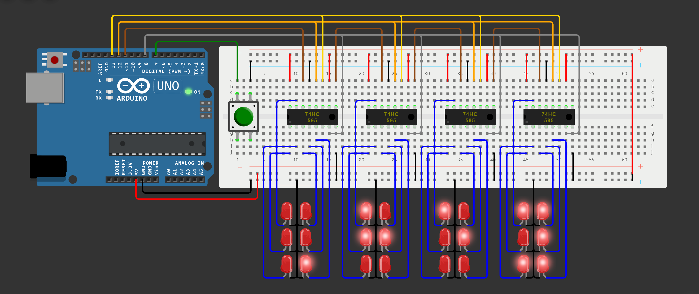

# braille_display

[![Wokwi][wokwi-badge-link]][wokwi-project-link]

This project implements a scalable multi-cell Braille display system using an Arduino - it converts input characters into their corresponding Braille patterns, providing accessibility for visually impaired users

[][latest-release-link]

## Table of Contents

- [Preparation](#preparation)
  - [In simulation via Wokwi](#1-in-simulation-via-wokwi)
  - [On real Arduino via PlatformIO in VSCode](#2-on-real-arduino-via-platformio-in-vscode)
  - [On real Arduino via ArduinoIDE](#3-on-real-arduino-via-arduinoide)
- [Usage](#usage)
- [Features](#features)
- [Configuration](#configuration)
- [Todo](#todo)
- [Contribution](#contribution)
- [License](#license)

## Preparation

### **1. In simulation via [Wokwi](https://wokwi.com)**

- Follow the [Wokwi-project link][wokwi-project-link]
> [!NOTE]  
> If Wokwi-project link is broken or project there is corrupted, please report it to [GitHub Issues](https://github.com/dakalamin/braille_display/issues), meanwhile:
> - Clone or [download][latest-release-link] and unpack the repository
> - Start a [blank Wokwi-project](https://wokwi.com/projects/new/blank)
> - Select **`diagram.json`** tab
> - Press ⏷ button to the right of **'Library Manager'** tab, then - **'Delete'** and confirm
> - Press ⏷ button once again, then - **'Upload file(s)...'**
> - Select all files from the project's **`src/`** folder and confirm
- Press green **'Play'** button to start the simulation 

### **2. On real Arduino via [PlatformIO](https://platformio.org) in VSCode**

- Install [Visual Studio Code](https://code.visualstudio.com) and launch it
- Install [PlatformIO IDE](https://marketplace.visualstudio.com/items?itemName=platformio.platformio-ide) extension for VSCode
- Clone or [download][latest-release-link] and unpack the repository
- Open **`braille_display/`** project's folder with VSCode
- Connect your Arduino via USB to your computer
> [!NOTE]
> `Arduino Uno` is set as default board in **`platformio.ini`** - if you use different board, do the following:
> - Click **'View'->'Command Palette...'** _(or press `Ctrl+Shift+P`)_
> - Paste `> PlatformIO: PlatformIO Home` and press `Enter`
> - Select **'Projects'** tab on the left
> - Search for the **braille_display** project and click **'Configure'**
> - Choose your board in **'Platform Options'->'board'**
> - Click **'Save'** in the upper right corner
- Press **'Upload'** button in the upper right corner of VSCode window _(or press `Ctrl+Alt+U`)_

### **3. On real Arduino via ArduinoIDE**

- Clone or [download][latest-release-link] and unpack the repository
- Use an appropriate script from the project's **`scripts/`** folder to change project structure _(double click it or call it from console)_:
  - **`toggle.batch`** for Windows
  - **`toggle.bash`**  for Linux
> [!Note]
> The reason for this is that ArduinoIDE demands project **`<name>.ino`** main code file as well as all other code files to be located in the homonymous **`<name>/`** folder
>
> You can call this script repeatedly to toggle back and forth between ArduinoIDE and PlatformIO project structures
>
> An alternative way is to do it manually:
> - Rename project's **`src/`** folder to **`main/`**
> - Rename **`main.cpp`** file to **`main.ino`**
- Open **`main.ino`** with ArduinoIDE
- Connect your Arduino via USB to your computer
> [!Warning]
> Make sure that:
> - all **`.h`** files are shown in the top tabs
> - board model selected in **'Tools'->'Board'** matches your Arduino model
- Press **'Upload'** button in the upper left corner of ArduinoIDE window _(or press `Ctrl+U`)_

## Usage

Send messages, that you want to translate and show, to the Serial Monitor

Press the button to display the next set of Braille patterns

## Features

- Program can translate following symbols into Braille:
  - **Latin** alphabet
  - **Cyrillic** alphabet
  - **Digits**
  - frequently used **Punctuation**

- You can send messages one after another not waiting for the previous ones to be shown - program will try to concatenate them until the `rx_buffer` _(receiving buffer)_ is full

- You can hold the button instead of repeatidly pressing it - program will display the next number of characters on the defined time interval

- You can easily scale the number of cells on the Braille display - the only change to the program you need to make is a single variable

- Program will keep the last part of the last message displayed until you send a new message and then press the button

- Program can process special cases of translating to Braille (e.g.: punctuation, modifiers, etc.)
  > 

  > 
Examples:

  >
  > - capital modifier is required before capital letters: **`XyZ`** -> **<code><ins>⠠</ins>⠭⠽<ins>⠠</ins>⠵</code>**
  > - numeric modifier is required before numbers: **`a 12`** -> **<code>⠁ <ins>⠼</ins>⠁⠃</code>**
  > - **.** (dot) symbol has different translations:
  >   - **`N.o`** -> **<code>⠠⠝<ins>⠲</ins>⠕</code>** _(grammatical dot)_
  >   - **`8.9`** -> **<code>⠼⠓<ins>⠨</ins>⠊</code>** _(decimal dot)_
  > - **\*** (asterisk) symbol is translated into a doubled **⠔** Braille pattern: **`5 * 6`** -> **<code>⠼⠑ <ins>⠔⠔</ins> ⠼⠋</code>**
  > - **"** (quote) symbol's Braille pattern alternates on opens and closes: **`m "q" n`** -> **<code>⠍ <ins>⠦</ins>⠟<ins>⠴</ins> ⠝</code>**
  > - **"** (quote) symbol, unpaired until EOM, is paired automatically: **`"k`** -> **<code>⠦⠅<ins>⠴</ins></code>**
  > 

- Program doesn't process characters in advance - it translates the least neccessary amount of characters to fill the Braille display after you press the button

- Program can wait for the next messages if last symbols of the current one don't have enough context to be translated to Braille correctly
  > 

  > 
Examples:

  >
  > First comes **<code>30<ins>.</ins></code>** message
  > - there is not enough context in the message for the **.** (dot) symbol to be translated to Braille
  > - program sends **`⠼⠉⠚`** patterns to the display (without **.** symbol) and waits for the next message:
  >   - then comes **`25`** message -> program shows **<code><ins>⠨</ins>⠃⠑</code>** _(decimal dot)_
  >    **-or-**
  >   - then comes **` re`** message -> program shows **<code><ins>⠲</ins>⠗⠑</code>** _(grammatical dot)_
  > 

## Configuration

You can configure the project to your liking:

Setting                 | Category  | Type | Default   | Notes
----------------------: |---------- | ---- | --------- | :----
`BUTTON_PIN`            | **`PIN`** | uint | `7`       | -
`AUTO_PIN`              | **`PIN`** | uint | `8`       | pin that receives `AUTOCOUNT` signal
`DATA_PIN`              | **`PIN`** | uint | `11`      | 74HC595 shift register - pin `DS`
`LATCH_PIN`             | **`PIN`** | uint | `12`      | 74HC595 shift register - pin `ST_CP`
`CLOCK_PIN`             | **`PIN`** | uint | `13`      | 74HC595 shift register - pin `SH_CP`
`BAUD_RATE`             | **`SRL`** | uint | `9600`    | Serial speed
`SERIAL_ECHO`           | **`SRL`** | bool | `true`    | if symbols must be printed to Serial as they are being sent to Braille display
`LF_IS_EOM`             | **`SRL`** | bool | `true`    | Linefeed is End-Of-Message _if false, messages before and after LF symbol are concatinated_
`SERIAL_NA_IS_EOM`      | **`SRL`** | bool | `false`   | Serial Not Available is End-Of-Message _if false, messages before and after Serial-not-available event are concatinated_
`BUTTON_CLICK_MS`       | **`BTN`** | uint | `100`     | min delay between consecutive clicks to prevent jitter _(in ms)_
`BUTTON_CYCLE_MS`       | **`BTN`** | uint | `1000`    | delay between autoclicks while button is kept pressed _(in ms)_
`BRAILLE_CELLS`         | **`CEL`** | uint | `4`       | number of Braille cells if they are not automatically counted
`AUTOCOUNT_CELLS`       | **`CEL`** | bool | `true`    | if Braille cells must be automatically counted
`AUTOCOUNT_BIT`         | **`CEL`** | uint | `7`       | bit number that contains `AUTOCOUNT` signal passed to `AUTO_PIN` `6`th bit corresponds to `Q6` shift register pin `7`th bit - to `Q7`
`ANIMATION_ON_START`    | **`ANM`** | bool | `true`    | if to play animation on start
`ANIMATION_MS_PER_CELL` | **`ANM`** | uint | `500`     | delay between each animation frame _(in ms)_

Configurations priority (from highest to lowest):
1. **`platformio.ini`**
    - **\[ works only if you use PlatformIO \]**
    - add required `-D <setting>=<value>` lines to `build_flags` section
    - if you want to change `BAUD_RATE`, consider editing `monitor_speed` instead
    _ (`BAUD_RATE` will be set automatically, ensuring Serial monitor speed is synchronized with it)_
2. **`src/custom_config.h`**
    - **\[ the preferred way \]**
    - uncomment neccessary defines and set their values
    - keep in mind that settings from **`platformio.ini`** can override settings defined here
3. **`src/config.h`**
    - **\[ please do not modify this file \]**
    - contains default setting values

## Todo

- Add translations to README
- Add tests
- Add WokwiCI action

## Contribution

Feel free to contribute to this project by submitting issues or pull requests!

## License

This project is open-source and available under the [MIT License](LICENSE)

[wokwi-badge-link]:    https://img.shields.io/badge/Wokwi-4A96E2?style=for-the-badge&logo=data%3Aimage%2Fsvg%2Bxml%3Bbase64%2CPHN2ZyB4bWxucz0iaHR0cDovL3d3dy53My5vcmcvMjAwMC9zdmciIHZpZXdCb3g9IjAgMCAxOS44MTYgMTYuNDA2Ij48ZyBmaWxsPSIjZmZmIj48cGF0aCBkPSJNNC4xOTIgMTUuNTI0Yy0uNjMtLjczOC0uNzY1LTEuODYzLS4zMi0yLjY4NC40MDUtLjc0OC4zNDYtMS4xMzYtLjU4My0zLjg0LS45MzctMi43My0xLjExNi0zLjA1LTEuOTM1LTMuNDU1LTEuOTE2LS45NS0xLjc2NS0zLjQ1My4yNDItNC4wMDFDMy40ODggMS4wMjcgNC45NyAyLjkzIDQuMDE0IDQuNjQ5Yy0uNDE2Ljc1LS4zNiAxLjExMy41OTMgMy44NjYuOTcgMi43OTYgMS4xMjYgMy4wNzEgMS45NjQgMy40NTYgMS4xOTIuNTQ5IDEuNjIgMS44ODQuOTY5IDMuMDI1LS42NSAxLjE0LTIuNTY2IDEuNDQxLTMuMzQ4LjUyOG0xLjkxMi0xLjAwM2MuNDY1LS4zOC40MjYtLjc5Ni0uMTAzLTEuMDk4LS4yMzgtLjEzNi0uNTQ0LS4xODYtLjY4MS0uMTEyLS40MjMuMjMtLjQwNyAxLjAxNC4wMjUgMS4yNi4yMjYuMTMuNTY3LjEwNy43Ni0uMDV6TTIuNjEyIDQuMTY0Yy4zNDYtLjE4OS4yMjQtMS4wNzgtLjE4LTEuMzA4LS4zMzctLjE5My0uOTk1LjI2OC0uOTguNjg2LjAxMy4zODcuODA5LjgxMyAxLjE2LjYyMm05LjMzMyAxMC44M2MtLjYzLS43MzgtLjc2NS0xLjg2My0uMzItMi42ODQuNDA1LS43NDguMzQ2LTEuMTM2LS41ODMtMy44NC0uOTM3LTIuNzMtMS4xMTYtMy4wNS0xLjkzNS0zLjQ1NS0xLjkxNi0uOTUtMS43NjUtMy40NTMuMjQyLTQuMDAxQzExLjI0LjQ5NyAxMi43MjMgMi40IDExLjc2NyA0LjExOWMtLjQxNi43NS0uMzYgMS4xMTMuNTkzIDMuODY2Ljk3IDIuNzk2IDEuMTI2IDMuMDcxIDEuOTY0IDMuNDU2IDEuMTkyLjU0OSAxLjYyIDEuODg0Ljk2OSAzLjAyNS0uNjUgMS4xNC0yLjU2NiAxLjQ0MS0zLjM0OC41MjhtMS45MTItMS4wMDNjLjQ2NS0uMzguNDI2LS43OTYtLjEwMy0xLjA5OC0uMjM4LS4xMzYtLjU0NC0uMTg2LS42ODEtLjExMi0uNDIzLjIzLS40MDcgMS4wMTQuMDI1IDEuMjYuMjI2LjEzLjU2Ny4xMDcuNzYtLjA1ek0xMC4zNjUgMy42MzRjLjM0Ni0uMTg5LjIyNC0xLjA3OC0uMTgtMS4zMDgtLjMzNy0uMTkzLS45OTUuMjY4LS45OC42ODcuMDEzLjM4Ni44MDkuODEyIDEuMTYuNjJ6Ii8%2BPHBhdGggZD0iTTQuNTQzIDE2LjIxNGMtMi4wMjctMS4xODctMS4zLTQuMTg1IDEuMDE1LTQuMTg1Ljc1IDAgLjgxNi0uMTc3IDEuODY0LTEuMTY5IDEuMDQ3LS45OTIgMi44MzMtMi42MjcgNC4wMzUtMy4yMjIuMzI0LjQ2LjU3MSAxLjYxNS42MDcgMS43NDgtLjc3MiAwLTIuNzUgMS41MTUtMy41ODggMi41MzgtLjgxLjk4OC0uOTg1IDEuNC0uOTI4IDIuMTg4LjA1Mi43My0uMDgxIDEuMTEtLjU0MSAxLjU0LS43OC43MjgtMS43ODcuOTU4LTIuNDY0LjU2Mm0xLjU2LTEuNjk1Yy4yMTUtLjU2LS4wMjUtLjkwMy0uNjM0LS45MDMtLjU5NCAwLS44OTYuNDEtLjY5My45NC4xOTguNTE1IDEuMTI1LjQ5IDEuMzI3LS4wMzdtNy4wODItMi40NjVzLjI4NC0uNTY1IDEuMzkyLTMuNzE3YzEuNDQtNC4wNzggMS41MDktNC40MDcgMS4wOTYtNS4yNjMtLjg4Ny0xLjg0LjgzNS0zLjY4NCAyLjY5MS0yLjg4LjY5NC4zLjkzMS41ODUgMS4yMzYgMS40OS4zMzIuOTgzLjMwMyAxLjE5LS4yNDQgMS43Mi0uMzQxLjMzLS44OTYuNzE2LTEuMjMxLjg1Ni0uNDcuMTk2LS45NzIgMS4yNTUtMi4xODYgNC42MTgtMS40NDMgMy45OTYtMS4wNiAyLjgxNy0uNjcgMy41NDEuOTYxIDEuNzktLjI2LjQ5Mi0yLjA4My0uMzY1em01LjA2Ni05Ljg1Yy0uMDA2LS42LS4zNTUtLjgzLS45MjEtLjYwNS0uMjU1LjEtLjQ4Ni4zMDktLjUxMy40NjItLjA4NS40NzMuNTM3Ljk1MSAxIC43NjguMjQxLS4wOTYuNDM3LS4zNzcuNDM0LS42MjUiLz48L2c%2BPC9zdmc%2B
[wokwi-project-link]:  https://wokwi.com/projects/410634164212519937
[latest-release-link]: https://github.com/dakalamin/braille_display/releases/latest
